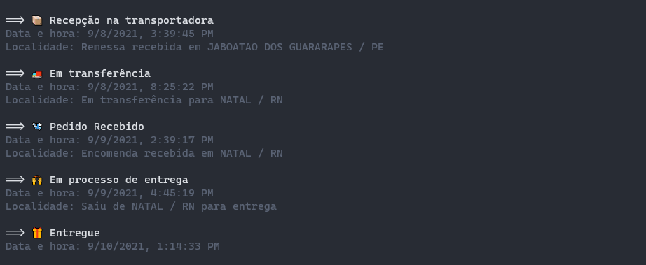

# Track Sequoia
📦 Terminal Track Sequoia

[](https://github.com/fagiani/track-sequoia/releases/latest)
[](https://github.com/fagiani/track-sequoia/releases/latest)
[](https://www.npmjs.com/package/track-sequoia)
[](https://github.com/fagiani/track-sequoia/issues)
[](https://github.com/fagiani/track-sequoia/blob/master/LICENSE.txt)

## 🚀 Demo



## ✨ Usage

```
npx track-sequoia [code]
```

## Development
To setup your development environment you'll need `node` and `yarn` installed on your machine.

To install the dependencies, run
```bash
yarn install
```
To run your code use
```bash
yarn start [code]
```

## 📣 Contributing

If you want to contribute please fork the repository and get your hands dirty, and make the changes as you'd like and submit the Pull Request. Any questions, open a issue.

## 👏 Aknowlegement

This project was inspired by [Maurício Mutte](https://github.com/mauriciomutte)'s project [Terminal Track Correios](https://github.com/mauriciomutte/track-correios).
